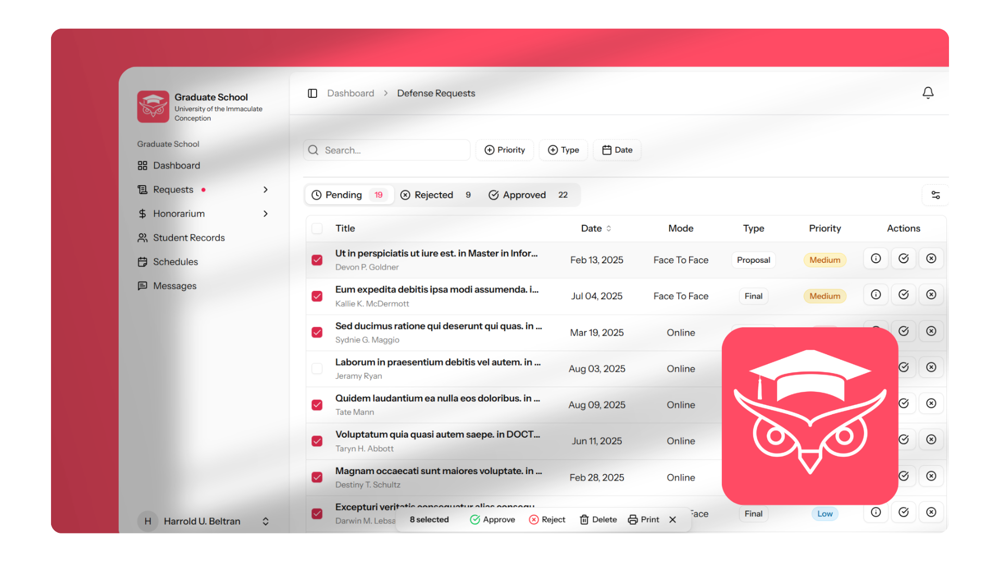

  

<h1 align="center">Graduate School System</h1>

  

---

## Description

The **Graduate School System** is a web application designed to modernize and streamline administrative workflows for UIC’s Graduate School. The application supports core administrative processes for students, coordinators, administrative staff, deans, and the registrar.

This repository is the combined work of three collaborating groups:
- **Defense Requests**
- **Honorariums**
- **Comprehensive Exams**

---

## Objectives

- Provide clear, role-based workflows for defense and comprehensive exam processes.
- Maintain accurate tracking of honorariums and related financial records.
- Improve transparency of statuses, schedules, and required documents.
- Support reporting and printable exports for academic and finance use.
- Deliver real-time notifications and updates for relevant stakeholders.

---

## Scope & Features

### System-wide
- Role-based access control and permissions
- Role-specific dashboards (pending items, upcoming schedules, counters)
- In-app notifications and real-time updates
- Audit logs for approvals, edits, and payment events
- Printable/exportable reports (PDF/CSV)

### Defense Requests
- Student submission and file uploads for defense requests
- Coordinator review, schedule editing, and panelist management
- Administrative Assistant approval and defense status management
- Dean/AA reporting and oversight for defense-related finances

### Honorariums
- CRUD for honorarium entries (panelists, amounts, statuses)
- Tracking of student-financial records tied to defense/exam activities
- Generation and printing of summary reports
- Receipt attachment and payment status tracking

### Comprehensive Exams
- Student application submission and document uploads
- Payment receipt uploads and application tracking
- Scheduling and examiner assignment (Coordinator / Dean / AA)
- Registrar document verification and official-status updates

---

## Roles (Summary)

- **Student:** Submit forms, upload documents/receipts, view status & schedules
- **Coordinator:** Review and track submissions, manage schedules, validate records
- **Administrative Assistant (AA):** Approve/deny requests, manage honorarium records, produce reports
- **Dean:** Oversight, reporting, final approvals
- **Registrar:** Verify documents, update official student record statuses

---

## Typical Workflows (High-Level)

- Student submits requests/applications and uploads supporting documents
- Coordinators and AAs process submissions, manage schedules, and update statuses
- Honorarium records are created and tracked as required
- Registrar verifies documents and updates official records
- Dashboards, notifications, and reports communicate status and outcomes to stakeholders

---

## Data & Reporting

- **Entities:** Students, defense requests, exam applications, panelists, honorarium records, schedules, receipts, documents
- **Reporting:** Period summaries, per-panelist payment history, per-student financial obligations, pending approvals, audit logs
- **Export formats:** CSV and printable PDF

---

## Architecture & Tech Stack

**Backend:**  
Laravel 12, PHP, Composer

**Frontend:**  
ReactJS with TypeScript, ShadCN UI, Tailwind CSS

**Real-time / Notifications:**  
Laravel Echo (compatible with Pusher or other WebSocket backends)

**Database & Hosting / Services:**  
Designed for local development (XAMPP) and managed environments (Laravel Cloud, Supabase)

**CI / CD:**  
GitHub Actions

**Other:**  
Node (npm/yarn) for frontend dependency management

---

## Contributors

### Defense Requests
- Weszley Keith Empasis
- Geoffrey Diapana
- John Paul Estano

### Honorarium
- Quezada Jim Nick
- Bianca Noreen Otara
- Troy Peralta

### Comprehensive Exam
- Nash Golosino
- King Philipp Fernandez
- Paul Honrada
